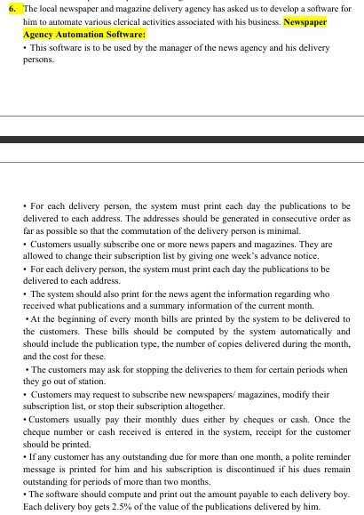

# Just a fun project



## Setup

### Prerequisites

- Python 3.x
- pip (Python package manager)

### Installation Steps

1. Clone the repository:

    ```bash
    git clone https://github.com/Lymore01/news_agency_automation.git
    cd news_agency_automation
    ```

2. Create a virtual environment:

    ```bash
    python -m venv venv
    ```

3. Activate the virtual environment:
   
   - **Windows**:  
     ```bash
     .\venv\Scripts\activate
     ```
   - **Mac/Linux**:  
     ```bash
     source venv/bin/activate
     ```

4. Install required dependencies:

    ```bash
    pip install -r requirements.txt
    ```

5. Set up the database:

    ```bash
    flask db upgrade
    ```

6. Run the development server:

    ```bash
    flask run
    ```

    The application should now be accessible at `http://127.0.0.1:5000/`.

## Usage

- **GET /customers**: List all customers.
- **GET /customers/{id}**: Get details of a specific customer.
- **POST /customers**: Create a new customer.
- **PUT /customers/{id}**: Update customer details.
- **DELETE /customers/{id}**: Delete a customer.

For the full API documentation, refer to the `/docs` endpoint.

## Contributing

1. Fork the repository.
2. Create your feature branch (`git checkout -b feature-branch`).
3. Commit your changes (`git commit -am 'Add new feature'`).
4. Push to the branch (`git push origin feature-branch`).
5. Create a new Pull Request.

## License

This project is licensed under the MIT License - see the [LICENSE](LICENSE) file for details.
